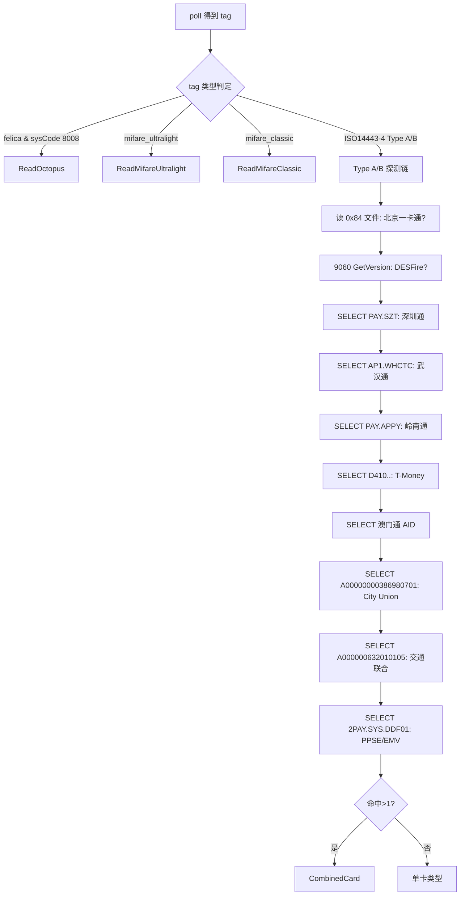
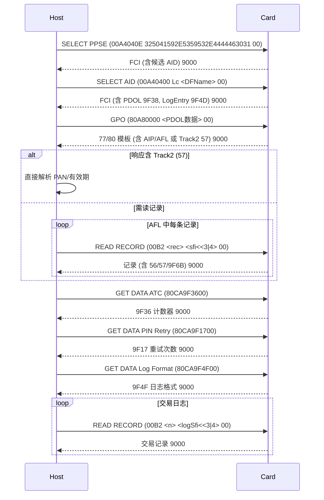
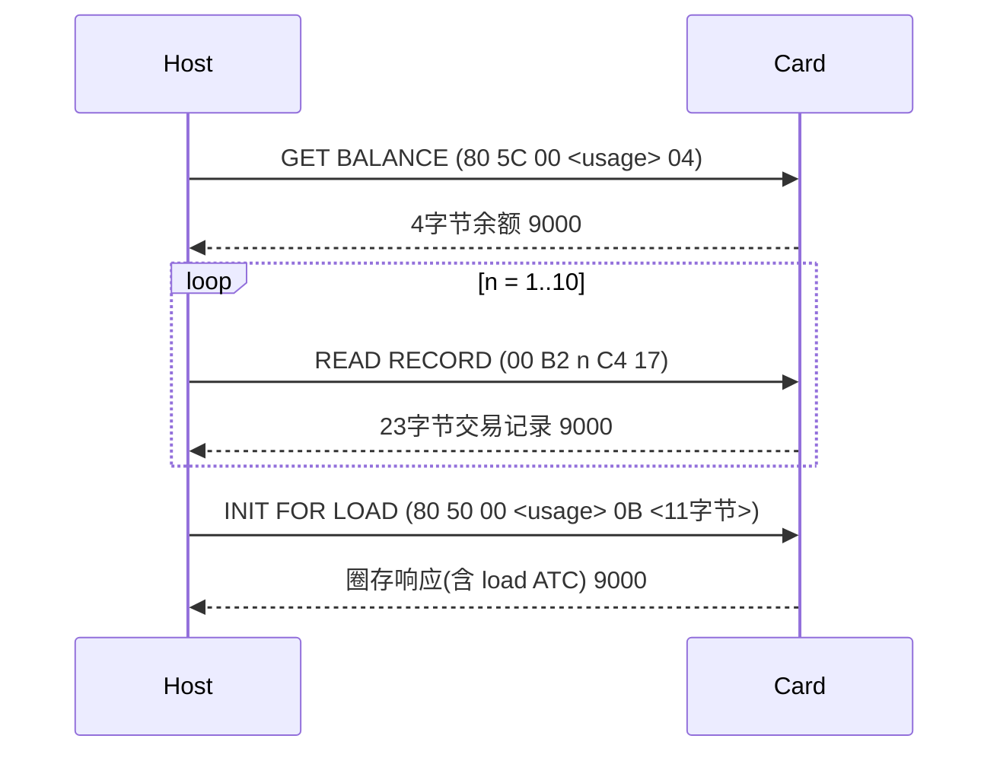
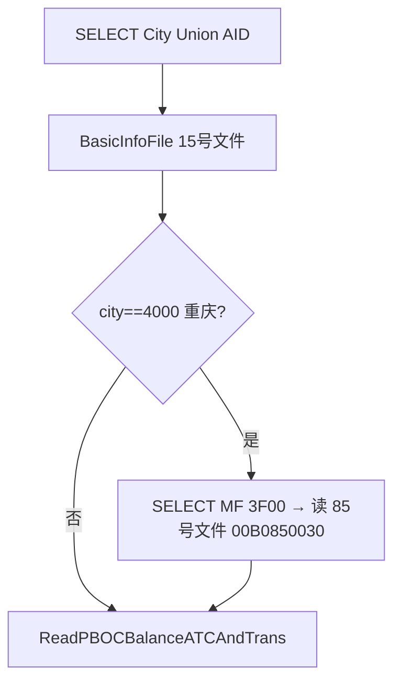
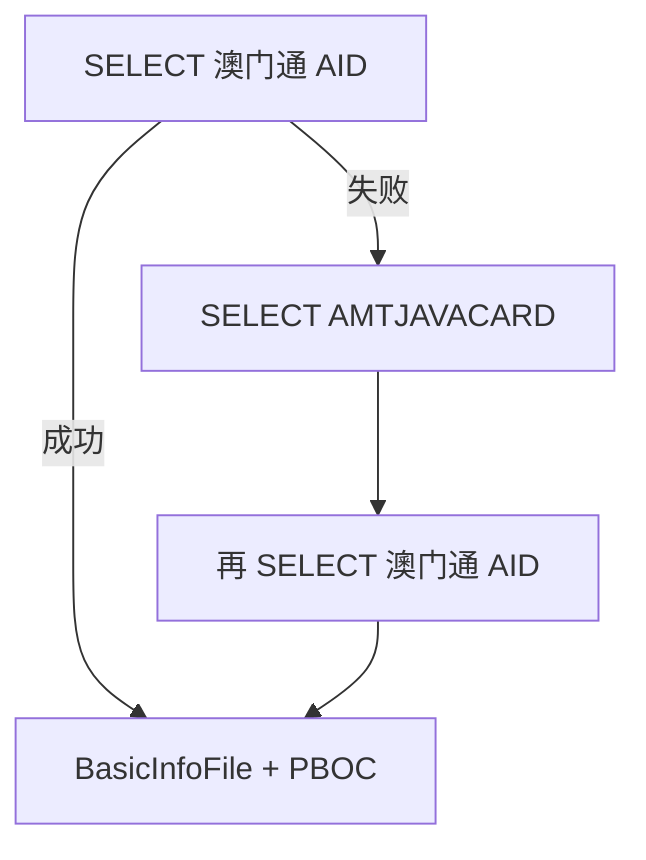
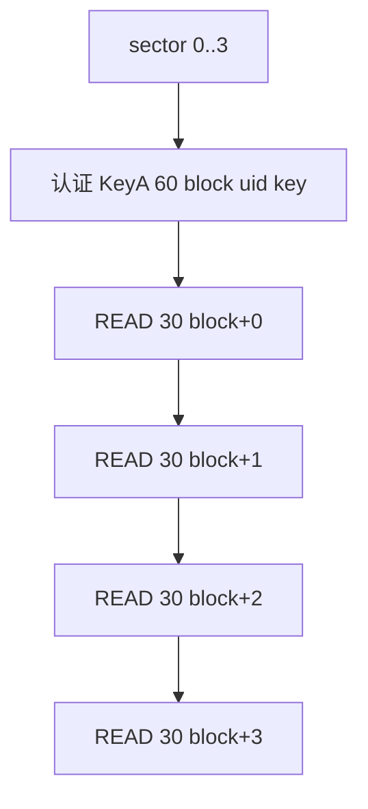
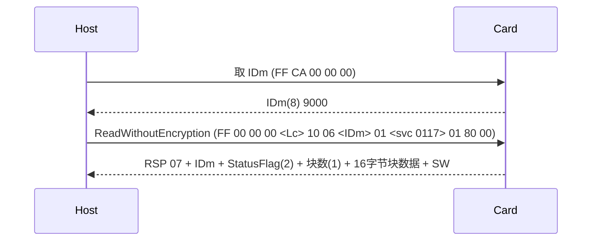

# 卡片 APDU 交互深度分析

本文档系统整理各类卡片的识别特征、APDU 交互流程、指令格式与上下文依赖，
作为 Rust PC/SC 读卡后端的实现依据。FeliCa（八达通）与 EMV 等章节含
ACR1251U 实机验证的指令与响应示例。

## 通用约定

### APDU 结构（ISO 7816-4）

| 字段 | 说明 |
|------|------|
| CLA | 指令类别。`00`=ISO 标准，`80`/`90`=专有，`FF`=PC/SC 伪 APDU |
| INS | 指令码。`A4`=SELECT，`B0`/`B2`=READ，`CA`=GET DATA，`5C`=GET BALANCE |
| P1/P2 | 参数 |
| Lc | 数据域长度 |
| Data | 数据域 |
| Le | 期望返回长度，`00` 表示最大 |

### 常见状态码（SW1 SW2）

| SW | 含义 |
|------|------|
| 9000 | 成功 |
| 900000 | 成功（部分国产卡返回 3 字节，PBOC 常见） |
| 61XX | 成功，还有 XX 字节可用 GET RESPONSE 取回 |
| 6CXX | Le 错误，正确长度为 XX |
| 6A82 | 文件或应用未找到 |
| 6A86 | P1/P2 参数错误 |
| 6982 | 安全状态不满足 |
| 6300 / 63CX | 认证失败（X 为剩余重试次数） |
| 91AF | DESFire：操作成功，还有后续帧（需 90AF 续取） |

### 传输抽象

所有卡种逻辑都建立在单一收发原语之上（发送 hex APDU，返回响应）。
在 PC/SC 下对应 `SCardTransmit`。

---

## 顶层探测流程

先按物理/协议层（由 ATR 或标签类型推断）分流，再在 ISO 14443-4 分支内
用一连串 SELECT AID 探测“叠加卡”（一枚芯片承载多个应用）。



> 关键点：Type A 分支采用“逐一 SELECT，成功即读”的策略，因此一枚芯片可能
> 同时命中多张卡（如交通联合 + EMV），聚合为 `CombinedCard`。
> 须保持探测顺序（尤其澳门通 AMTJAVACARD 放最后，避免影响后续 SELECT）。

---

## 一、EMV 非接支付卡（Visa / MasterCard / 银联 / JCB / AMEX / Discover）

对应 `ReadPPSE`。

### 识别特征

- Select AID：`2PAY.SYS.DDF01`（PPSE，非接支付系统环境目录）。
- 从 PPSE FCI 的 TLV 中取 DF Name（路径 `6F → A5 → BF0C → 61 → 4F`），
  按前缀匹配品牌：

| AID 前缀 | 品牌 |
|----------|------|
| A000000333010101/02/03 | 银联借记/贷记/准贷记 |
| A000000003 | Visa |
| A000000004 | MasterCard |
| A000000025 | AMEX |
| A000000065 | JCB |
| A000000324 | Discover |

### 交互流程



### APDU 明细

| 步骤 | APDU | 说明 | 预期 SW |
|------|------|------|---------|
| SELECT PPSE | `00 A4 04 00 0E 325041592E5359532E4444463031 00` | 选非接目录 | 9000 |
| SELECT AID | `00 A4 04 00 Lc <AID> 00` | 选具体应用 | 9000 |
| GPO | `80 A8 00 00 Lc 83 <len> <PDOL数据> 00` | 发起交易，取 AIP/AFL | 9000 |
| READ RECORD | `00 B2 <rec> <SFI<<3\|0x4> 00` | 读应用记录 | 9000 / 6A83 |
| GET DATA ATC | `80 CA 9F 36 00` | 应用交易计数器 | 9000 |
| GET DATA PIN | `80 CA 9F 17 00` | PIN 重试次数 | 9000 |
| GET DATA Log | `80 CA 9F 4F 00` | 交易日志格式 | 9000 |

### PDOL 构造（BuildRespOfPDOL）

GPO 前需按卡片 FCI 中的 PDOL（tag `9F38`）逐项填充终端数据，常见默认值：

| Tag | 含义 | 默认填充 |
|-----|------|----------|
| 9F66 | 终端交易属性 | 26000000 |
| 9F02 | 授权金额 | 000000000001 |
| 9F1A | 终端国家代码 | 0156 |
| 9F37 | 不可预知数 | 11223344 |
| 9A | 交易日期 | 200331 |
| 9C | 交易类型 | 00 |
| 5F2A | 交易货币代码 | 0156 |

未知 tag 用 `00` 按长度填充。响应封装为 `83 <总长> <数据>`。

### 上下文依赖

- **必须先 SELECT PPSE 再 SELECT AID**：AID 从 PPSE FCI 中解析。
- **GPO 依赖 SELECT AID 返回的 PDOL**。
- **READ RECORD 依赖 GPO 返回的 AFL**（Application File Locator，
  格式为 4 字节组：SFI / 起始记录 / 结束记录 / 离线认证记录数）。
- Track2（tag `57`）优先；无则解析 Track1（`56`）或 `9F6B`。
- 交易日志 READ RECORD 的 SFI 来自 Log Entry（`9F4D`），格式来自 `9F4F`。

---

## 二、PBOC 交通卡通用流程（ReadPBOCBalanceATCAndTrans）

深圳通、武汉通、岭南通、City Union、交通联合、澳门通等都复用此流程。

### 交互流程



### APDU 明细

| 步骤 | APDU | 说明 | 预期 SW |
|------|------|------|---------|
| 取余额 | `80 5C 00 <usage> 04` | usage=2 电子钱包 / 1 电子存折 | 9000 |
| 读交易记录 | `00 B2 <n> C4 17` | 循环读第 n 条，SFI=0x18(C4=0x18<<3\|4) | 9000 直到失败 |
| 圈存初始化 | `80 50 00 <usage> 0B 01000000010000000000 10` | 取圈存 ATC | 9000 |

### 交易记录字节布局（23 字节）

| 偏移(hex 位) | 字段 | 说明 |
|--------------|------|------|
| 0..4 | 交易序号 | 大端 |
| 10..18 | 金额 | 大端，% 0x80000000 |
| 18..20 | 交易类型(TTI) | 06=消费, 02=圈存, 09=复合消费 |
| 20..32 | 终端号 | 北京卡终端号前缀 300 编码线路 |
| 32..40 | 日期 | YYYYMMDD |
| 40..46 | 时间 | HHMMSS |

### 余额解析

余额 = 前 4 字节大端整数 % 0x80000000（最高位为符号/正负标志）。

---

## 三、深圳通（ShenzhenTong）

对应 `ReadTransShenzhen`。

### 识别特征
- SELECT AID：`PAY.SZT`（`00A40400 07 5041592E535A54 00`）。

### 流程


### 数据布局（15 号文件）
- 卡号：偏移 32..40（hex 位），十六进制转十进制。
- 发行日期：40..48；有效期：48..56。

### 上下文依赖
- 先 SELECT PAY.SZT，再走 BasicInfoFile（`00B095001E` 或从 FCI 的 `9F0C` 取）。

---

## 四、武汉通（WuhanTong）

对应 `ReadTransWuhan`。

### 识别特征
- SELECT AID：`AP1.WHCTC`（`00A40400 09 4150312E5748435443 00`）。

### 流程与深圳通一致（BasicInfoFile + PBOC 通用流程）。

### 数据布局（15 号文件）
- 卡号：偏移 24..40；发行日期 40..48；有效期 48..56。

---

## 五、岭南通（LingnanPass）

对应 `ReadLingnanTong`。

### 识别特征
- SELECT AID：`PAY.APPY`（`00A40400 08 5041592E4150505900`）。

### 流程


### 上下文依赖
- 岭南通需**二次 SELECT**（PAY.TICL）才能读到钱包；卡号取自 15 号文件偏移 22..32。

---

## 六、City Union 城市一卡通（含重庆特例）

对应 `ReadCityUnion`。

### 识别特征
- SELECT AID：`A0000000038698070100`（`00A40400 09 A0000000038698070100`）。

### 流程


### 数据布局
- 城市代码：15 号文件偏移 4..8（对照 ChinaPostCode 表）。
- 卡号：24..40；发行 40..48；有效期 48..56（重庆特例取 16..24）。

### 上下文依赖
- 重庆卡需切回主文件（SELECT `3F00`）再读 `00B0850030`。

---

## 七、交通联合 T-Union（全国交通一卡通）

对应 `ReadTUnion`。

### 识别特征
- SELECT AID：`A00000063201010500`（`00A40400 08 A000000632010105 00`）。

### 流程


### APDU 明细
| 步骤 | APDU | 说明 |
|------|------|------|
| 17 号文件(DF11) | `00 B0 97 00 0B` | 省市/卡类型 |
| 行程记录 | `00 B2 <n> F4 00` | SFI=0x1E（P2=0x1E<<3\|4=0xF4），循环读到失败 |

### 数据布局
- 卡号：15 号文件偏移 20..40（去前导 0）。
- 17 号文件（DF11）：省 8..12，市 12..16，类型 20..22。
- 行程记录（SFI 0x1E，每条为进出站/乘车明细）：与钱包交易记录（SFI 0x18）
  分离，需单独读取。原始字节交前端解析（进出站类型、线路、金额、时间戳）。

### 上下文依赖
- 先走通用余额/交易流程，再额外读 17 号文件（`00B097000B`）获取省市/卡类型，
  最后循环读 SFI 0x1E 行程记录（`00 B2 <n> F4 00`）。

---

## 八、澳门通（MacauPass）

对应 `ReadMacauPass`。

### 识别特征
- 主路径 SELECT AID：`B0C4C3C5CDA8C7AEB0FC`。
- 备用路径：先 SELECT `AMTJAVACARD`（414D544A41564143415244）容器，再选上面的 AID。

### 流程


### 数据布局与特殊换算
- 卡号：15 号文件偏移 70..80。
- 余额换算：`balance*10 - 1000`（单位 $0.01）；交易金额 `*10`。

### 上下文依赖
- 备用路径必须放在**整个探测链最后**，因为 SELECT AMTJAVACARD 后
  某些多应用卡的其它 AID SELECT 会失败。

---

## 九、北京一卡通（BMAC）

对应 `ReadTransBeijing`。

### 识别特征
- **无需 SELECT AID**，直接读 `00 B0 84 00 20`（04 号文件），
  成功（9000）且内容以 `1000` 开头即判定为北京卡。

### 流程


### 数据布局
- 卡号：04 号文件偏移 0..16；发行 48..56；有效期 56..64。
- 终端号前缀 `300` + 两位线路码 → 对照 `BJ_Subway_ID2NAME`（如 88=大兴机场线）。

### 上下文依赖
- 命中后需 SELECT `1001` 目录（`00A4000002100100`）再读钱包。

---

## 十、T-Money（韩国）

对应 `ReadTMoney`。

### 识别特征
- SELECT AID：`D410000003000100`（`00A40400 07 D410000003000100`）。
- Purse info 直接内嵌于 SELECT 返回的 FCI（跳过前 4 字节）。

### 流程


### APDU 明细
| 步骤 | APDU | 说明 |
|------|------|------|
| 取余额 | `90 4C 00 00 04` | 专有指令，4 字节余额 |
| 读记录 | `00 B2 <n> 24 2E` | SFI=4(24=4<<3\|4)，长度 0x2E |

### 数据布局
- 卡号：purse_info 偏移 24..34；发行 34..42；有效期 42..50。
- 记录类型：01=消费, 02=充值。

---

## 十一、Mifare Ultralight / NTAG

对应 `ReadMifareUltralight`。

### 识别特征
- `tag.type == "mifare_ultralight"`。
- GET VERSION 命令 `60`（裸命令）返回 8 字节版本信息。

### 流程


### 版本字节解析（8 字节）
| 偏移 | 字段 |
|------|------|
| 1 | 厂商(04=NXP) |
| 2 | 产品类型(03=UL, 04=NTAG) |
| 3 | 子类型(02=50pF) |
| 4-5 | 主/次版本 |
| 6 | 存储容量(2^n) |

- 由 storage size 判定型号：0x0F=NTAG213(45页), 0x11=NTAG215(135页), 0x13=NTAG216(231页)。

### READ 命令
- 裸命令 `30 <page>`：一次返回 4 页 = 16 字节。

### PC/SC 移植注意
- 手机用裸命令 `60`/`30xx`；ACR 读卡器需改用伪 APDU
  `FF B0 00 <page> <len>` 读块，GET VERSION 需专用直传。

---

## 十二、Mifare Classic

对应 `ReadMifareClassic`。

### 识别特征
- `tag.type == "mifare_classic"`。

### 流程


### 密钥
- 使用 MAD/NDEF 公共默认密钥：`A0A1A2A3A4A5`、`D3F7D3F7D3F7`。

### 裸命令
- 认证：`60 <block> <uid(4)> <key(6)>`。
- 读块：`30 <block>`。

### PC/SC 移植注意
- ACR 读卡器：LOAD KEY `FF 82 ...` + AUTHENTICATE `FF 86 ...` + READ `FF B0 ...`。

---

## 十三、Mifare DESFire

对应 `ReadMifareDESFire`。

### 识别特征
- Type A 分支下，GET VERSION `90 60 00 00 00` 返回以 `91AF` 结尾。

### 流程


### 数据解析
- 硬件版本：厂商/类型/子类型/版本/容量(2^n)。
- 生产信息：BCD 周/年 → `week X of year 20YY`。

### 上下文依赖
- DESFire 用 `91AF` 表示“还有后续帧”，需连续用 `90 AF 00 00 00` 续取。

---

## 十四、Octopus（八达通，FeliCa）

八达通为 FeliCa 卡。ATR 中含 `11 00 3B` 即判定为 FeliCa
（例：`3B8F8001804F0CA00000030611003B0000000042`）。

### ACR1251U 访问方式（实机验证）

不同于手机 NFC 直接下 FeliCa 帧，ACR1251U 用两类 PC/SC 命令访问 FeliCa
（见 ACR API 手册 5.2.6）：

1. 取 IDm：标准 `FF CA 00 00 00`，返回 8 字节 IDm + `9000`。
   无需 Polling —— IDm 由读卡器在防冲突阶段已获取。
2. FeliCa 命令：`FF 00 00 00 <Lc> <FeliCa命令>`，其中 FeliCa 命令
   以长度字节开头，`<len> <cmd> <payload...>`，len 含自身。

### FeliCa 帧结构
`<len> <cmd> <payload>`，len 含自身长度。

### 流程（读余额块）


### 命令码
| CMD | 含义 |
|-----|------|
| 0x06 | Read Without Encryption |

### 参数
- 余额服务码：`0x0117`（发送时小端 `17 01`）。
- Read block 命令体：`06 <IDm(8)> 01 <svc_lo> <svc_hi> 01 80 <addr>`，
  前置长度字节后封装为 `FF 00 00 00 <Lc> <10 06 …>`（`10`=16 字节命令长度）。

### 实机示例
```
取 IDm:
>> FFCA000000
<< 012805013F2591079000            # IDm = 012805013F259107

读余额块 (block 0):
>> FF000000 10  1006 012805013F259107 01 1701 01 8000
<< 1D 07 012805013F259107 0000 01 00000347 0000000000000000000000 26 9000
```
响应拆解（对应 Read Without Encryption 响应，响应码 `07`）：
- `1D` 响应长度，`07` 响应码，`012805013F259107` IDm，
  `0000` StatusFlag1/2（00=正常），`01` 块数，
  `00000347 0000000000000000000000` = 16 字节块数据。

### 数据解析
- IDm：`FF CA 00 00 00` 响应前 8 字节。
- 余额：块数据前 4 字节大端（例 `00000347` = 839）；
  `(值 - 500) * 10` 得单位 $0.01 港币（839 → HK$33.90）。

### PC/SC 移植注意
- FeliCa 帧经 ACR 直传伪 APDU（`FF 00 00 00 <Lc> <frame>`）发送。
- IDm 用 `FF CA 00 00 00` 取，无需自行发 Polling 帧。

---

## 移植到 PC/SC 的关键差异汇总

| 方面 | 手机 NFC | PC/SC |
|------|----------|--------------------|
| 协议层判定 | NFC 底层 `tag.standard`/`type` | 解析 ATR（PC/SC 合成格式） |
| ISO14443-4 APDU | 直接透传 | 直接透传（SCardTransmit） |
| Mifare 裸命令 | `60`/`30xx` 直发 | 伪 APDU `FF B0/82/86` |
| FeliCa 帧 | 直接下帧 | 直传封装 `FF 00 00 00 ..` |
| 3 字节 SW(900000) | 判 `endsWith('900000')` | 需按实际返回处理 |
| DESFire 91AF | 循环续帧 | 同样，但经 SCardTransmit |

以上分析构成后端 `cards/*` 模块的实现依据。后端仅按此流程抓取原始字节，
所有偏移解析（卡号/余额/交易/GBK 文本/TLV）均留给前端处理。